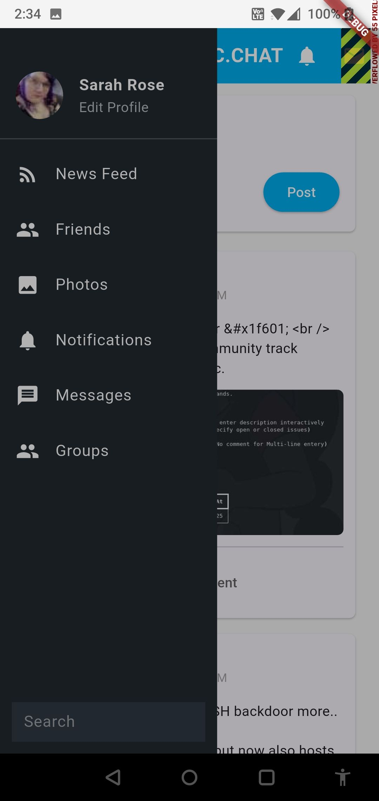

# TransIRC OSSN‑APP 📱

A free, open‑source Flutter app connecting to any OSSN (Open Source Social Network) server using TransIRC’s enhanced OSSN API documentation.

Designed for TransIRC, built for **everyone**.

---

## 🚀 Features (Work‑in‑Progress)

- 🔐 **Working login** via OSSN authentication endpoints  
- 🧱 **Live wall feed**: Displays real posts from your OSSN server  
- 🛠️ All other screens are placeholder—ready for your contribution!

---

## 📚 Based on

- **OSSNServices** API—core backend for mobile & 3rd‑party access  
- **TransIRC API docs**: expanded endpoint list, request/response examples, error codes  
  - See the **TransIRC/OSSN‑API‑Documentation** repo  

---

## 📸 Screenshots

**1. Login screen**  


**2. Wall feed with real content**  


---

## 🔧 Getting Started

1. **Clone** this repo:
   ```bash
   git clone https://github.com/TransIRC/OSSN-APP.git
   cd OSSN-APP

    Install dependencies

flutter pub get

Configure API host: in lib/config.dart, set your OSSN server URL.

Run the app:

    flutter run

    Login, view the wall—you're live!

🌱 Roadmap & Contributions

Full posting capability (text, images, privacy settings)

Profile, friends list, groups, notifications

Real‑time chat (if supported by OSSN backend)

    Localization, theming, UI polish

Contributions welcome! Issue trackers, pull requests, feature requests—all are encouraged.
🛡️ License & Attribution

    Open source under MIT license (or choose another permissive license)

    Built for TransIRC and anyone using OSSN

    Inspired by, and fully interoperable with, OSSNServices and OSSN WebServices APIs

🙏 Why This Matters

The official OSSN API is barely documented, leaving mobile devs stuck reading PHP code. TransIRC’s work decodes these endpoints, offering:

    Clear API descriptions

    Sample JSON requests & responses

    Better error handling, status codes, formatting

So devs can build full-featured clients without endless guesswork.

Join us! Make OSSN mobile a reality 💬

TransIRC Team


